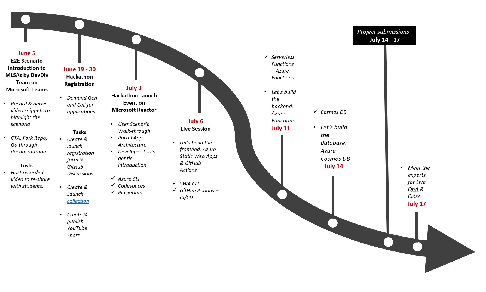

# Hack Together: Static Web Apps, Azure Functions & Cosmos DB with JavaScript

  

## Hack Together: Static Web Apps, Azure Functions & Cosmos DB with JavaScript

From July 3-17, 2023 we ran **Hack Together: Static Web Apps, Azure Functions & Cosmos DB with JavaScript** - a virtual hackathon for beginners to get started building scenario-based apps using JavaScript, Static Web Apps, Azure Functions & Cosmos DB.

In this hackathon, participants will learn how to build apps based on top of JavaScript End to End scenarios, and met Microsoft JavaScript Leaders, Cloud Advocates, MVPs and Student Ambassadors. 

## Resources

- 🏡 An E2E App Development Guide: [Build a modern serverless web application using a composable architecture and cloud-native technologies.](https://happy-tree-0d4a38b10.2.azurestaticapps.net/)

[comment]:<> (Continue your journey)
[comment]:<> (## Continue your journey)
[comment]:<> (## Become a Trainer)

## Hack Together Roadmap 🗺️

Follow the steps below to successfully complete the hackathon.

## Watch the sessions 🎥

**Complete the Learn Modules in our Official Collection**

* **[July 3rd - Register Live 🎥](https://aka.ms/hack-together/session01):** Kickoff Hack Together: Static Web Apps, Azure Functions & Cosmos DB with JavaScript! See an End-to-End JavaScript Scenario first-hand

* **[July 6th  - Register Live 🎥](https://aka.ms/hack-together/session02):** Microsoft Engineers will show you how to get started with Azure Static Web Apps for your Frontend and configure continous deployment!

* **[July 11th  - Register Live 🎥](https://aka.ms/hack-together/session03):** Microsoft Engineers will show you how to get started with Serverless Functions for your Backend!

* **[July 14th  - Register Live 🎥](https://aka.ms/hack-together/session04):** Microsoft Engineers will show you how to configure and connect to a Database using Azure Cosmos DB!

## Recommended Learning Materials

* [Documentation - Azure Static Web Apps](https://learn.microsoft.com/en-us/azure/static-web-apps/)
* [Documentation - Azure Functions](https://learn.microsoft.com/en-us/azure/azure-functions/)
* [Documentation - Azure CosmosDB](https://learn.microsoft.com/en-us/azure/cosmos-db/)
* [JavaScript at Microsoft](https://developer.microsoft.com/en-us/javascript/)

## Recommended Channels and Communities
* [Microsoft Reactor](https://www.youtube.com/channel/UCkm6luGCS3hD25jcEhvRMIA)

  

